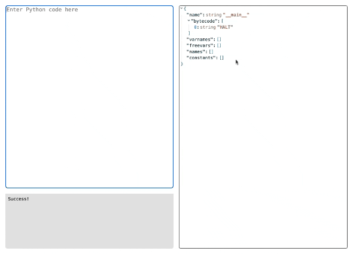

# Interactive Bytecode Compiler



## Introduction

This repo contains an interactive Python bytecode compiler, built using React about powered by [Memphis](https://github.com/JonesBeach/memphis).

As a result, it does not support the full CPython [dis module](https://docs.python.org/3/library/dis.html), but rather an in-progress [feature set](https://github.com/JonesBeach/memphis/blob/main/docs/SUPPORTED.md).

An embedded version can be found on [From Scratch Code](https://fromscratchcode.com/bytecode-compiler/).

## Local Development

```bash
npm install
npm run dev
```

## License
The software is granted under the terms of the MIT License. For details see the file LICENSE included with the source distribution. All copyrights are owned by their respective authors.
